# E-Commerce ETL Pipeline Architecture

```mermaid
flowchart TB
    subgraph Source["📦 Data Source"]
        CSV1["customers.csv"]
        CSV2["orders.csv"]
        CSV3["order_items.csv"]
        CSV4["products.csv"]
        CSV5["sellers.csv"]
        CSV6["payments.csv"]
        CSV7["reviews.csv"]
    end

    subgraph Extract["🔄 Extract Layer (Python)"]
        PY1["extract.py"]
        PY2["load_raw.py"]
        PY1 --> PY2
    end

    subgraph Staging["🗄️ Raw Storage (PostgreSQL)"]
        PG1[("raw.customers")]
        PG2[("raw.orders")]
        PG3[("raw.order_items")]
        PG4[("raw.products")]
        PG5[("raw.sellers")]
        PG6[("raw.payments")]
        PG7[("raw.reviews")]
    end

    subgraph Cloud["☁️ Cloud Data Warehouse"]
        SF1[("Snowflake RAW Schema")]
    end

    subgraph Transform["⚙️ Transform Layer (dbt)"]
        DBT1["Staging Models
        - stg_customers
        - stg_orders
        - stg_order_items
        - stg_products
        - stg_sellers"]
        
        DBT2["Analytics Models (Star Schema)
        
        Dimensions:
        - dim_customers
        - dim_products
        - dim_sellers
        
        Facts:
        - fact_orders
        - fact_order_items"]
        
        DBT1 --> DBT2
    end

    subgraph Analytics["📊 Analytics Layer"]
        DWH[("Snowflake ANALYTICS Schema")]
    end

    subgraph BI["📈 Business Intelligence"]
        SQL["SQL Queries
        - Revenue Analysis
        - Product Performance
        - Customer Behavior"]
        
        VIZ["Python Visualizations
        - Monthly Revenue
        - Top Products
        - Category Analysis"]
    end

    CSV1 & CSV2 & CSV3 & CSV4 & CSV5 & CSV6 & CSV7 --> PY1
    PY2 --> PG1 & PG2 & PG3 & PG4 & PG5 & PG6 & PG7
    PG1 & PG2 & PG3 & PG4 & PG5 & PG6 & PG7 --> SF1
    SF1 --> DBT1
    DBT2 --> DWH
    DWH --> SQL
    DWH --> VIZ

    style Source fill:#e1f5ff
    style Extract fill:#fff4e1
    style Staging fill:#f0f0f0
    style Cloud fill:#e8f5e9
    style Transform fill:#fff3e0
    style Analytics fill:#f3e5f5
    style BI fill:#fce4ec
```

## Pipeline Stages

### 1. 📦 **Data Source**
- **Format**: CSV files
- **Dataset**: Olist Brazilian E-Commerce
- **Size**: 100K+ transactions, 8 tables

### 2. 🔄 **Extract & Load (Python)**
- **Scripts**: `extract.py`, `load_raw.py`
- **Function**: Read CSV → Load to PostgreSQL
- **Libraries**: Pandas, SQLAlchemy

### 3. 🗄️ **Raw Storage (PostgreSQL)**
- **Purpose**: Staging area for raw data
- **Schema**: `raw` schema with 7 tables
- **State**: Unmodified source data

### 4. ☁️ **Cloud Data Warehouse (Snowflake)**
- **RAW Schema**: Replication of PostgreSQL raw data
- **Scalable**: Cloud-based analytical processing

### 5. ⚙️ **Transform Layer (dbt)**
- **Staging Models**: Data cleansing, standardization, quality tests
- **Analytics Models**: Star schema with business logic
- **Version Control**: SQL-based transformations in Git

### 6. 📊 **Analytics Layer**
- **ANALYTICS Schema**: Production-ready data models
- **Optimized**: Star schema for fast queries
- **Tested**: dbt tests ensure data quality

### 7. 📈 **Business Intelligence**
- **SQL Analytics**: Revenue, products, customer analysis
- **Visualizations**: Python (Matplotlib, Seaborn)
- **Insights**: Data-driven business decisions

---

## Technology Stack

| Layer | Technology | Purpose |
|-------|------------|---------|
| **Extraction** | Python, Pandas | Load raw data from CSV |
| **Raw Storage** | PostgreSQL | Staging database |
| **Cloud DWH** | Snowflake | Scalable analytics platform |
| **Transformation** | dbt | SQL-based data modeling |
| **Orchestration** | Airflow (optional) | Pipeline scheduling |
| **Analytics** | SQL, Python | Business analysis |
| **Version Control** | Git, GitHub | Code management |

---

## Data Quality & Testing

- ✅ **dbt Tests**: Unique, not_null, relationships
- ✅ **Schema Validation**: Automated checks on all models
- ✅ **Referential Integrity**: Foreign key relationships enforced
- ✅ **Data Lineage**: Full visibility from source to analytics

