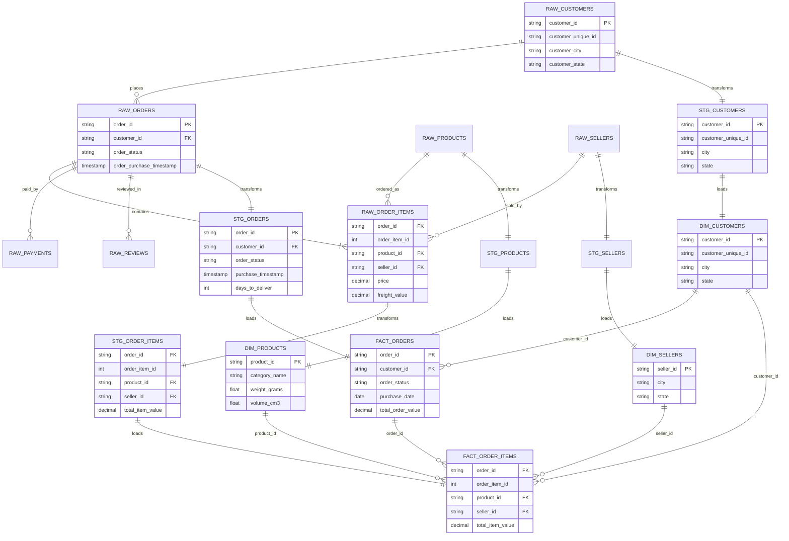

# Complete ERD Diagram - E-Commerce ETL Pipeline

## Full Data Flow: Raw → Staging → Analytics

## Data Pipeline Layers

### 1. **RAW Layer** (PostgreSQL/Snowflake Raw Schema)
- 7 source tables loaded from CSV files
- No transformations, original data structure preserved
- Source: Olist Brazilian E-Commerce Dataset

### 2. **STAGING Layer** (dbt Staging Models)
- 5 staging models with data cleansing
- Column renaming and standardization
- Data quality tests (unique, not_null, relationships)
- Basic calculated fields

### 3. **ANALYTICS Layer** (dbt Marts - Star Schema)
- 3 Dimension tables (SCD Type 1)
- 2 Fact tables (transaction grain)
- Business logic and metrics
- Optimized for analytical queries

## Key Relationships

| From Table | To Table | Relationship | Cardinality |
|------------|----------|--------------|-------------|
| dim_customers | fact_orders | customer_id | 1:N |
| dim_customers | fact_order_items | customer_id | 1:N |
| dim_products | fact_order_items | product_id | 1:N |
| dim_sellers | fact_order_items | seller_id | 1:N |
| fact_orders | fact_order_items | order_id | 1:N |

